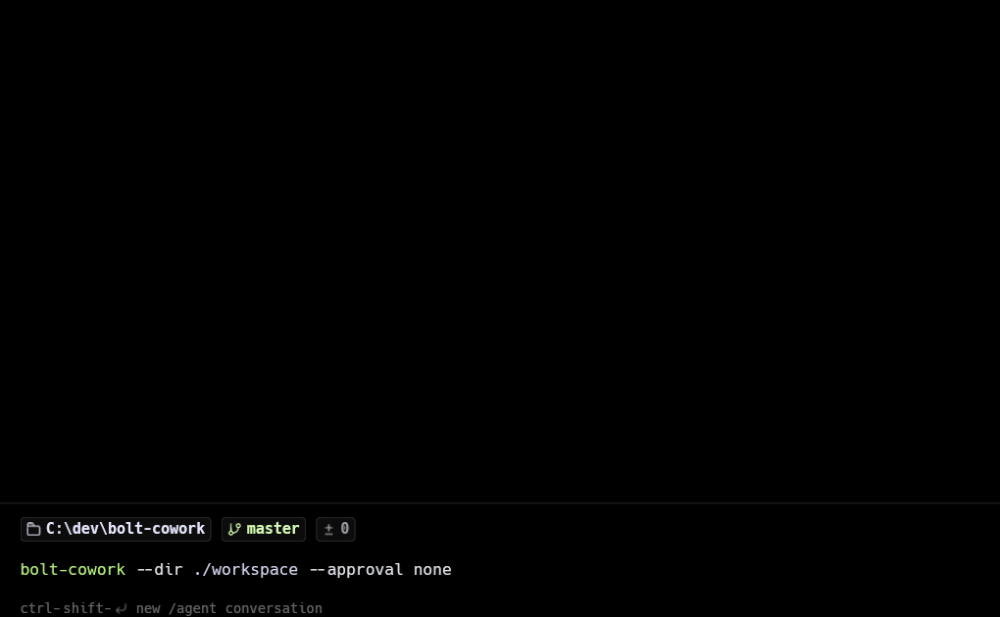

# Bolt Cowork

[](https://goreportcard.com/report/github.com/halukerenozlu/bolt-cowork)
[](https://pkg.go.dev/github.com/halukerenozlu/bolt-cowork)
[](https://codecov.io/gh/halukerenozlu/bolt-cowork)

A CLI-based local file agent platform inspired by [Claude Cowork](https://claude.com/product/cowork). Give it access to a folder, describe a task in natural language, and it gets the work done.



## Status

**v0.2.6** -- Stabilization release: Windows security hardening, error style consistency, banner fix, startup sequence polish.

## Features

- **Sandbox** -- Restricts file access to allowed directories with path validation, denied patterns, symlink escape protection, read-only directories, and narrow traversal checks
- **Protected Path Enforcement** -- Symlink resolution, case-insensitive matching on Windows, NTFS Alternate Data Stream blocking, reserved filename protection (CON, PRN, AUX, NUL, COM1-9, LPT1-9)
- **Secret Redaction** -- API keys and secrets stripped from all output paths before display
- **Config** -- YAML configuration (`~/.bolt-cowork/config.yaml`), auto-created on first run, runtime reload via `/config reload`
- **LLM Providers** -- Pluggable provider interface with Anthropic, OpenAI, and Gemini APIs, fallback chain
- **Agent Loop** -- Plan, approve, execute, report cycle with configurable approval gates
- **Readline REPL** -- Tab completion, persistent command history (`~/.bolt-cowork/history`), line editing shortcuts
- **8 Action Types** -- read, list, write, delete (recursive), move, rename, copy, mkdir
- **Skill System** -- SKILL.md files with YAML frontmatter and scope (bundled/global/project), keyword matching, prompt injection, `/use` manual activation
- **Plan Revision** -- Revise plans with feedback up to 3 times before re-submitting
- **Conversation History** -- Multi-turn context with 20-turn FIFO cap, `/clear` to reset
- **Runtime Controls** -- Switch models (auto-detects provider), change API keys, reload config, change working directory without leaving REPL
- **Typo Suggestions** -- Unknown slash commands suggest the closest match via Levenshtein distance
- **Clean Cancellation** -- Ctrl+C returns to REPL with `Command cancelled.`

## Quick Start

**Requirements:** Go 1.26+

```bash
git clone https://github.com/halukerenozlu/bolt-cowork.git
cd bolt-cowork
make install

bolt-cowork
```

On first run, the setup wizard guides you through provider selection, API key, model, and workspace configuration.

## REPL Commands

| Command               | Description                                                                       |
| --------------------- | --------------------------------------------------------------------------------- |
| `/help`               | Show available commands                                                           |
| `/model`              | Show current model                                                                |
| `/model <name>`       | Switch model (auto-detects provider): haiku, sonnet, opus, gpt-4o, gemini-2.5-pro |
| `/clear`              | Reset conversation history                                                        |
| `/key`                | Show current API key (masked)                                                     |
| `/key set`            | Change API key for active provider                                                |
| `/key <provider>`     | Show API key for specific provider                                                |
| `/key set <provider>` | Change API key for specific provider                                              |
| `/config`             | Show current config (keys masked)                                                 |
| `/config path`        | Show config file path                                                             |
| `/config reload`      | Reload config from disk                                                           |
| `/dir`                | Show current workspace directory                                                  |
| `/dir <path>`         | Change workspace directory                                                        |
| `/dir -`              | Switch back to previous workspace directory                                       |
| `/init`               | Initialize `.cowork/` in the working directory                                    |
| `/init force`         | Reinitialize (overwrite) `.cowork/`                                               |
| `/skills`             | List all loaded skills                                                            |
| `/skill <name>`       | Show skill details                                                                |
| `/skill create`       | Create a new custom skill interactively                                           |
| `/use <name>`         | Activate skill for next command (one-shot)                                        |
| `/mode`               | Show current approval mode                                                        |
| `/mode <name>`        | Set approval mode: `plan`, `build`, `strict`, `none`                              |
| `/quit`               | Exit REPL                                                                         |

Tab completion works for all commands and subcommands. Unknown commands trigger typo suggestions.

## Approval Modes

| Mode             | Behavior                                                      |
| ---------------- | ------------------------------------------------------------- |
| `full`           | Every step requires approval, including reads (default)       |
| `plan-only`      | Only plan stage requires approval                             |
| `dangerous-only` | Read/list auto-approve; writes/deletes/moves require approval |
| `none`           | Fully automatic                                               |

## Project Structure

```
bolt-cowork/
├── cmd/bolt-cowork/     # CLI entry point, REPL, init wizard
├── internal/
│   ├── agent/           # Agent loop, planner, executor, approval, levenshtein
│   ├── config/          # YAML config loading and validation
│   ├── mcp/             # MCP client (v0.3)
│   ├── prompt/          # Prompt templates and helpers
│   ├── tool/            # Tool definitions and helpers
│   ├── provider/        # LLM provider interface + fallback chain
│   ├── sandbox/         # File access restriction, read-only dirs
│   └── skill/           # Skill system: loader, matcher, injector (v0.2)
├── pkg/types/           # Shared types (Message, Role, StepAction)
├── docs/testing/        # Documentation
├── testdata/fixtures/   # Test fixtures and sample configs
└── skills/              # Default SKILL.md files (file-organizer, summarizer)
```

## Configuration

Config file: `~/.bolt-cowork/config.yaml`

```yaml
default_provider: anthropic

providers:
  anthropic:
    api_key: your-anthropic-key
    models:
      - claude-sonnet-4-6
  openai:
    api_key: your-openai-key
    models:
      - gpt-4o
  gemini:
    api_key: your-gemini-key
    models:
      - gemini-2.5-pro

sandbox:
  allowed_dirs:
    - ./workspace
  read_only_dirs:
    - ~/Documents/reference
  denied_patterns:
    - "*.env"
    - "*.key"
    - ".ssh/*"

approval_mode: full
```

Use `/config reload` to apply changes without restarting.

## Development

```bash
make build          # Build binary
make install        # Install with version injection
make test           # Run all tests with race detector
make lint           # Run go vet
make clean          # Remove binary
```

See [CONTRIBUTING.md](CONTRIBUTING.md) for the contribution process and [SECURITY.md](SECURITY.md) for vulnerability reporting.

## Roadmap

| Version  | Feature                                                             |
| -------- | ------------------------------------------------------------------- |
| **v0.1** | ✅ Core agent loop (sandbox, config, provider, CLI)                 |
| **v0.2** | ✅ Skill system, security hardening, stabilization                  |
| v0.3     | Foundation + MCP client (JSON-RPC 2.0, external tool access) ← next |
| v0.4     | TUI (charmbracelet/bubbletea terminal interface)                    |
| v0.5     | Sub-agent coordination (parallel tasks via goroutines)              |
| v0.6     | Custom LLM provider (self-trained model support)                    |
| v0.7     | Desktop App — if needed (if TUI is insufficient)                    |

See [VISION.md](VISION.md) for the full project vision and [CHANGELOG.md](CHANGELOG.md) for detailed release notes.

## License

[MIT](LICENSE)
